# 个人博客SpringBoot+Vue3项目

## 技术栈

- **SpringBoot3**：框架的核心知识点。
- **Redis**：缓存技术，用于提高数据处理速度和效率。
- **MyBatis**：数据库框架，加深了对ORM和数据库交互的理解。
- **MySQL**:   最流行的关系型数据库
- **Vue**：前端主流框架，基础知识点的掌握。
- **Element-plus**：异步函数库，处理HTTP请求。
- **Pinia**：状态管理，维护应用的状态。
- **Axios**：异步函数库，处理HTTP请求。
- **Webpack**：JavaScript模块打包工具

## 开发工具

- 后端：IntelliJ IDEA 2023.2.5 (Ultimate Edition)

- 前端：Web Storm 2023.2.4 (Ultimate Edition)

- Redis：Another Redis Desktop Manager

- MySQL：Navicat for Mysql 

- 接口调试工具：Postman

## 重要技术 

- **阿里云OSS**: 实现文件的上传与访问

- **参数校验框架Validation**: 深入理解了`@Validated`的使用场景和自定义注解校验。

- **密码加密与解密**：采用md5对密码进行加密与解密

- **认证技术Jwt**:  用户登录成功后下发token,发送其他请求时在Interceptor校验token

- **ThreadLocal**: 将从token中解析出来的业务数据存储到ThreadLocal中，保证了数据隔离性

- **单元测试junit**: 编写和运行单元测试,用于确保代码的质量和可靠性。

- **Redis**:  将token存入Redis中

- **vue-router路由**: Vue的路由管理。

- **pinia状态管理**: 状态管理，维护应用的状态。

## 项目预览

### 1.登录功能

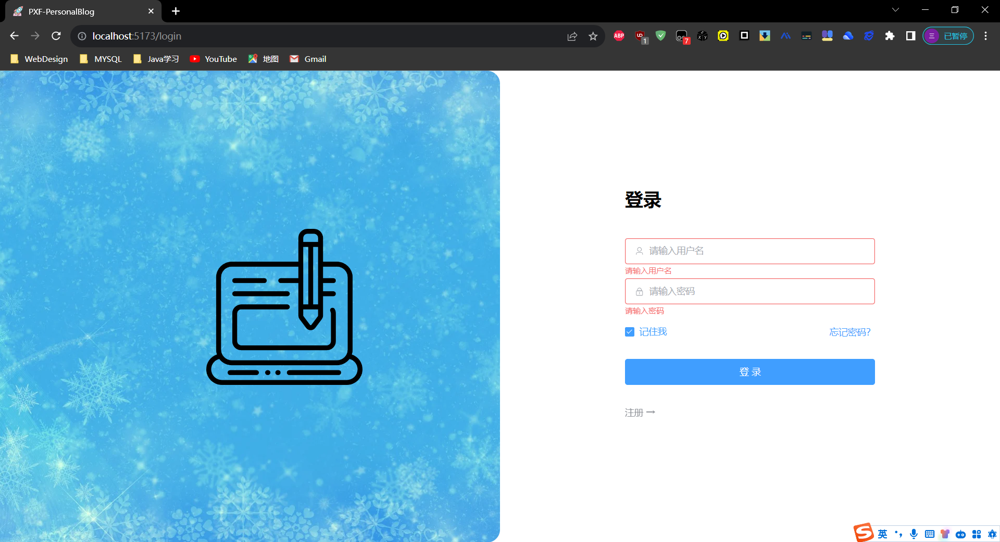

### 2.主界面

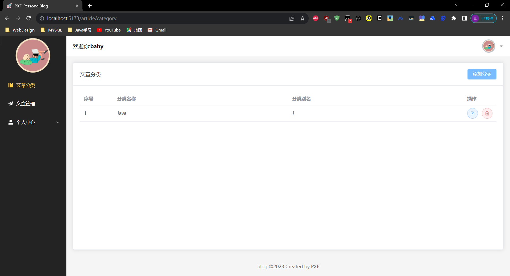

### 3.文章分类

#### 3.1 添加分类

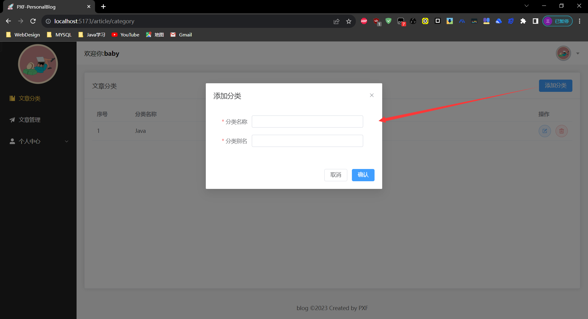

#### 3.2 更新分类

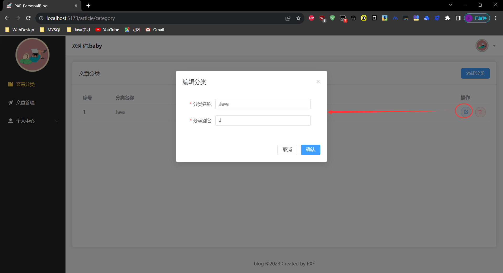

#### 3.3 删除分类

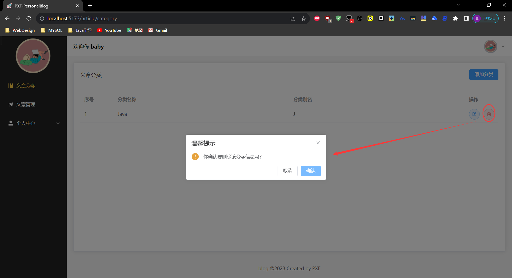

### 4.文章管理

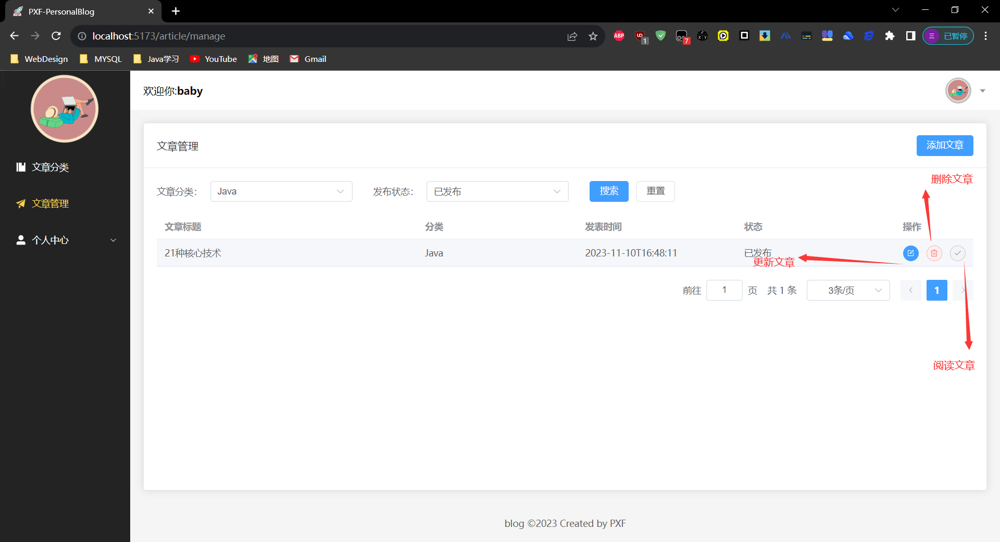

#### 4.1 文章筛选

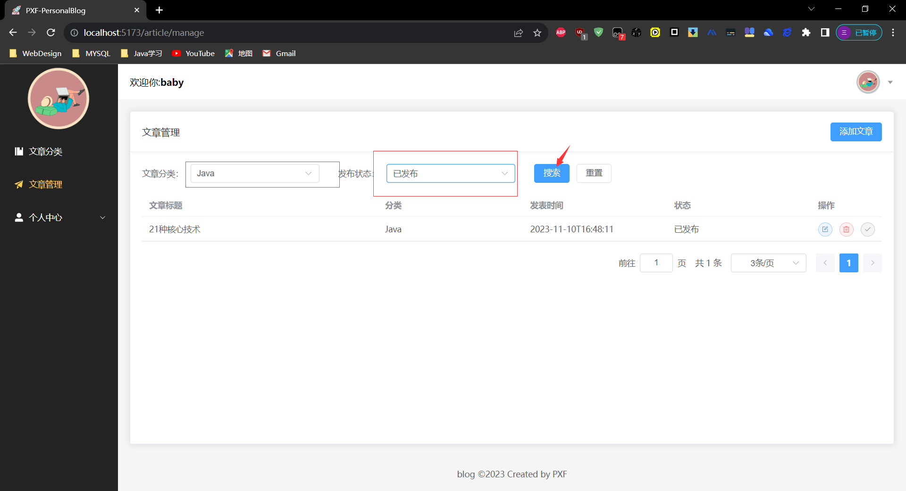

#### 4.2 添加文章

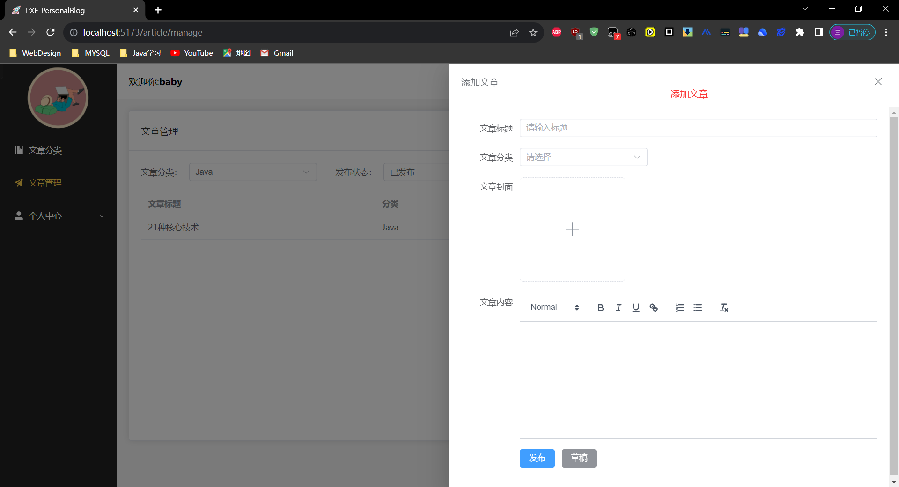

#### 4.3 更新文章

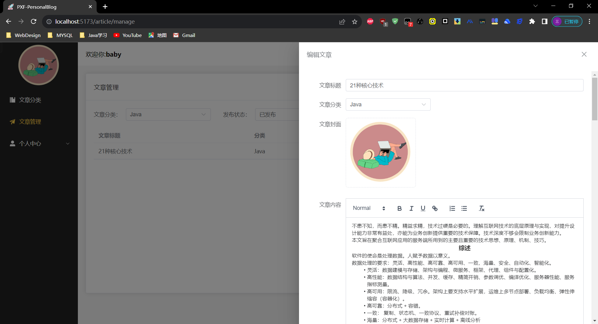

#### 4.4 删除文章

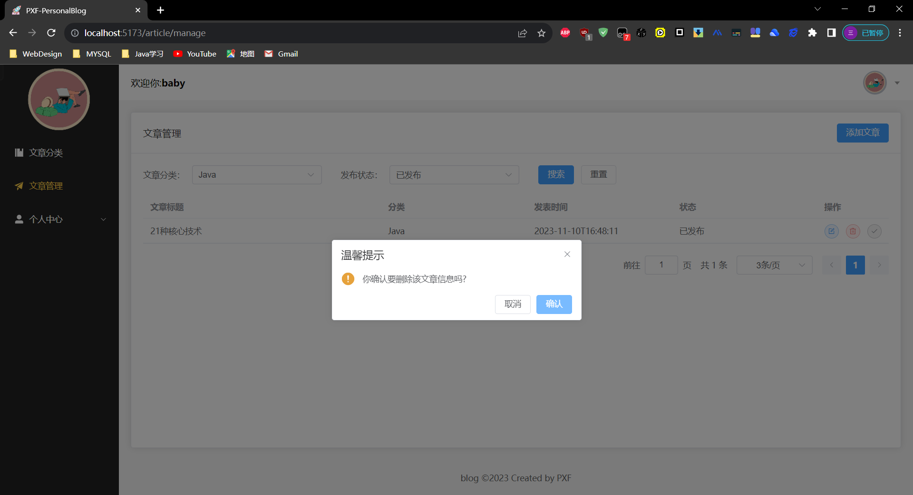

#### 4.5 阅读文章

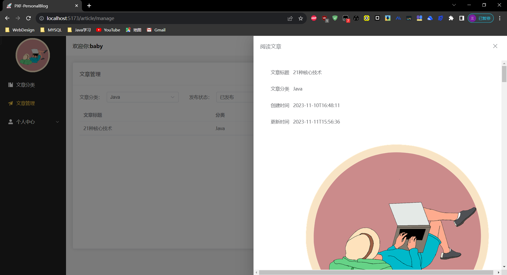

### 5.个人中心

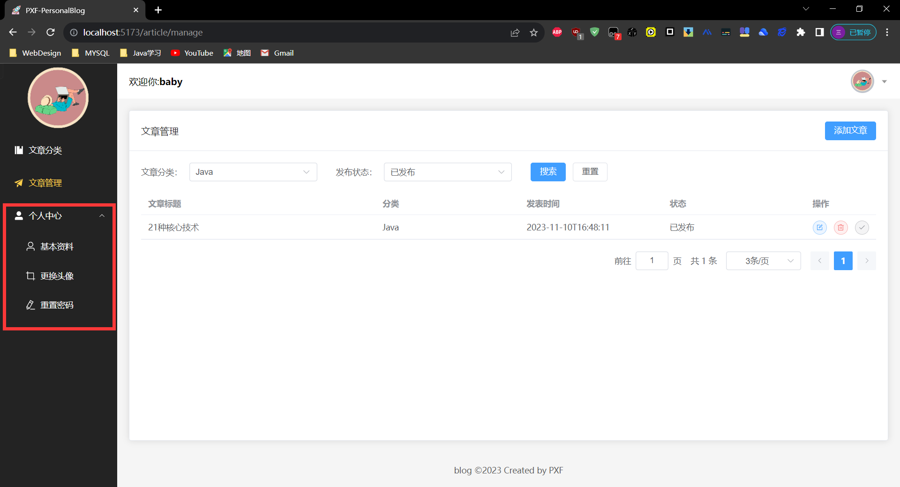

#### 5.1 基本资料

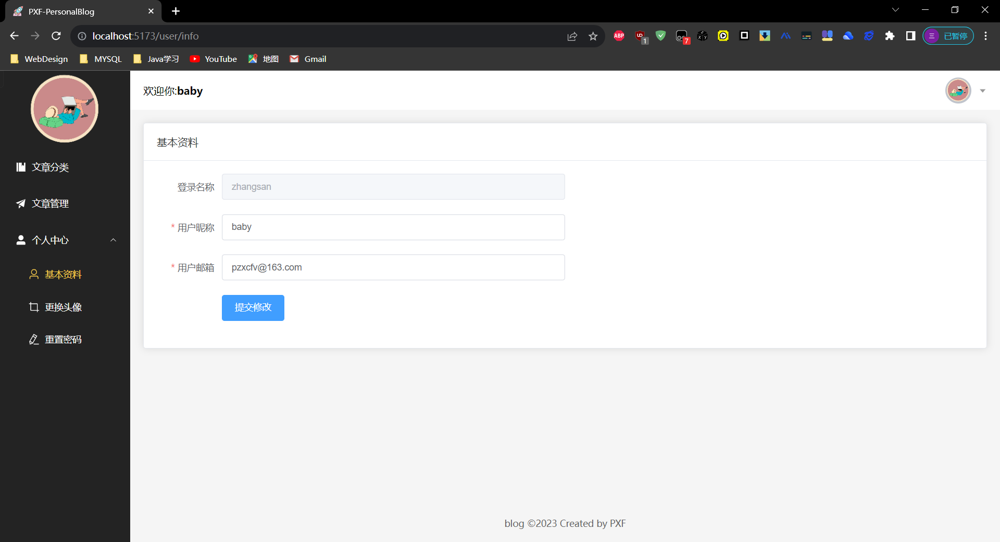

#### 5.2 更换头像

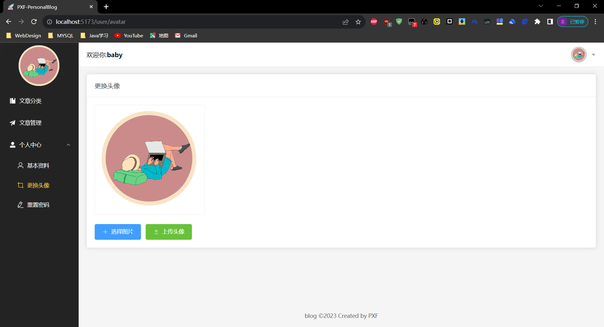

#### 5.3 重置密码

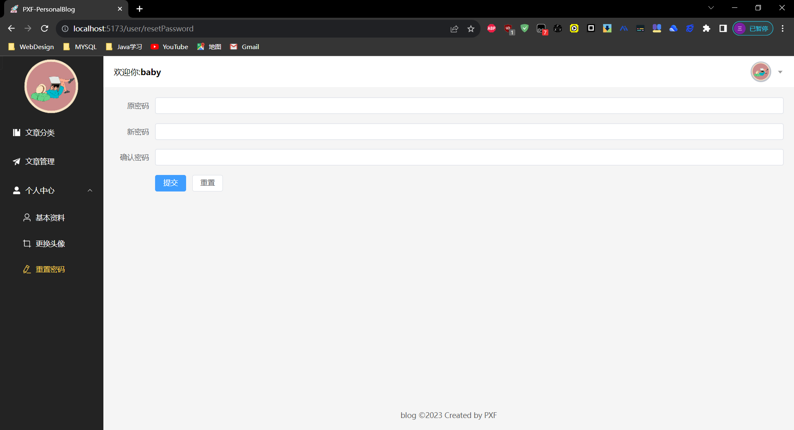

### 6.退出登录

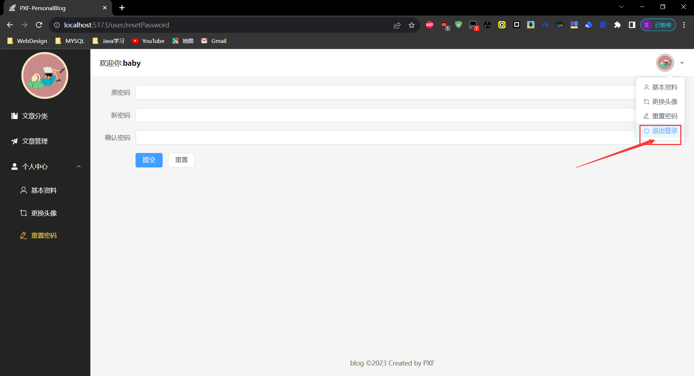

